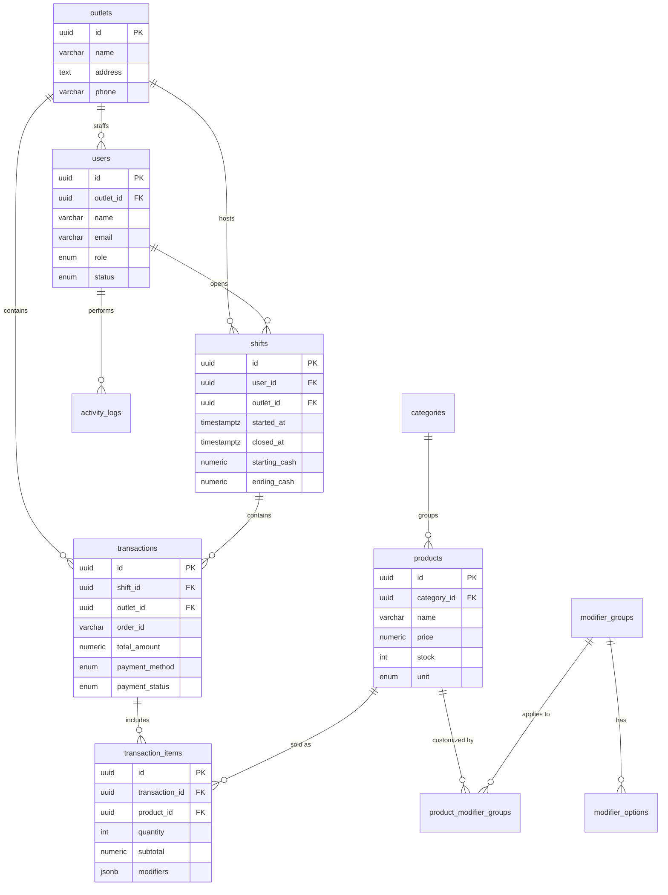

# Small Things Coffee POS — Data Model Document

> **Database:** PostgreSQL 15+
> **Migration Tool:** [golang-migrate](https://github.com/golang-migrate/migrate)
> **Naming Convention:** `snake_case` for all tables, columns, and constraints

---

## 1. Entity List

| # | Entity | Description | Key Relationships |
|---|--------|-------------|-------------------|
| 1 | `users` | Employees (owner or cashier) logging via OAuth | Cashiers linked to `outlets` |
| 2 | `outlets` | Physical store locations (branches) | Has many `users`, `shifts`, `transactions` |
| 3 | `categories` | Product groupings (Coffee, Snack, etc.) | Has many `products` |
| 4 | `products` | Centralized items sold at the POS | Belongs to `categories`, linked to `modifier_groups` |
| 5 | `modifier_groups` | Groups of customization options (Size, Sugar) | Has many `modifier_options` |
| 6 | `modifier_options` | Individual choices (Small, Medium, Large) | Belongs to `modifier_groups` |
| 7 | `product_modifier_groups` | Junction: modifier groups applied to products | Links `products` ↔ `modifier_groups` |
| 8 | `shifts` | A cashier's work session tracking cash | Belongs to `users` + `outlets` |
| 9 | `transactions` | A completed order/sale | Belongs to `shifts` + `outlets` |
| 10| `transaction_items` | Line items within a transaction | Belongs to `transactions`, references `products` |
| 11| `settings` | Global app configuration (receipt, tax) | Singleton (1 row only) |
| 12| `activity_logs` | Audit trail of user actions | References `users`, `outlets` |

---

## 2. Entity Relationship Diagram



---

## 3. Physical Database Schema (DDL)

### 3.1 Extensions & Types

```sql
-- Enable UUID generation
CREATE EXTENSION IF NOT EXISTS "uuid-ossp";

-- Custom ENUM types
CREATE TYPE user_role AS ENUM ('owner', 'cashier');
CREATE TYPE user_status AS ENUM ('active', 'inactive');
CREATE TYPE outlet_status AS ENUM ('active', 'inactive');
CREATE TYPE product_unit AS ENUM ('pcs', 'kg', 'liter', 'porsi', 'cup');
CREATE TYPE shift_status AS ENUM ('open', 'closed');
CREATE TYPE payment_method AS ENUM ('cash', 'qris');
CREATE TYPE payment_status AS ENUM ('pending', 'paid', 'void');
CREATE TYPE activity_type AS ENUM ('login', 'logout', 'start_shift', 'end_shift', 'transaction');
```

### 3.2 Core Tables

```sql
-- =============================================
-- OUTLETS (store locations)
-- =============================================
CREATE TABLE outlets (
    id              UUID PRIMARY KEY DEFAULT uuid_generate_v4(),
    name            VARCHAR(255) NOT NULL,
    address         TEXT,
    phone           VARCHAR(20),
    email           VARCHAR(255),
    open_time       TIME,
    close_time      TIME,
    status          outlet_status NOT NULL DEFAULT 'active',
    created_at      TIMESTAMPTZ NOT NULL DEFAULT NOW(),
    updated_at      TIMESTAMPTZ NOT NULL DEFAULT NOW()
);

-- =============================================
-- USERS (employees: owner or cashier logging via OAuth)
-- =============================================
CREATE TABLE users (
    id              UUID PRIMARY KEY DEFAULT uuid_generate_v4(),
    outlet_id       UUID REFERENCES outlets(id) ON DELETE SET NULL, -- Nullable for Owner
    name            VARCHAR(255) NOT NULL,
    email           VARCHAR(255) NOT NULL UNIQUE, -- Used for OAuth matching
    role            user_role NOT NULL DEFAULT 'cashier',
    status          user_status NOT NULL DEFAULT 'active',
    created_at      TIMESTAMPTZ NOT NULL DEFAULT NOW(),
    updated_at      TIMESTAMPTZ NOT NULL DEFAULT NOW()
);

CREATE INDEX idx_users_email ON users(email);
CREATE INDEX idx_users_outlet ON users(outlet_id);
```

### 3.3 Product Catalog (Centralized)

```sql
-- =============================================
-- CATEGORIES
-- =============================================
CREATE TABLE categories (
    id          UUID PRIMARY KEY DEFAULT uuid_generate_v4(),
    name        VARCHAR(100) NOT NULL,
    created_at  TIMESTAMPTZ NOT NULL DEFAULT NOW()
);

-- =============================================
-- PRODUCTS
-- =============================================
CREATE TABLE products (
    id                  UUID PRIMARY KEY DEFAULT uuid_generate_v4(),
    category_id         UUID REFERENCES categories(id) ON DELETE SET NULL,
    name                VARCHAR(255) NOT NULL,
    price               NUMERIC(12, 2) NOT NULL CHECK (price >= 0),
    stock               INTEGER NOT NULL DEFAULT 0 CHECK (stock >= 0),
    unit                product_unit NOT NULL DEFAULT 'pcs',
    low_stock_threshold INTEGER NOT NULL DEFAULT 10,
    description         TEXT,
    image_url           VARCHAR(512), -- Cloudinary URL
    is_active           BOOLEAN NOT NULL DEFAULT TRUE,
    is_favorite         BOOLEAN NOT NULL DEFAULT FALSE,
    created_at          TIMESTAMPTZ NOT NULL DEFAULT NOW(),
    updated_at          TIMESTAMPTZ NOT NULL DEFAULT NOW()
);

CREATE INDEX idx_products_category ON products(category_id);

-- =============================================
-- MODIFIER GROUPS & OPTIONS
-- =============================================
CREATE TABLE modifier_groups (
    id          UUID PRIMARY KEY DEFAULT uuid_generate_v4(),
    name        VARCHAR(100) NOT NULL,
    required    BOOLEAN NOT NULL DEFAULT FALSE,
    created_at  TIMESTAMPTZ NOT NULL DEFAULT NOW()
);

CREATE TABLE modifier_options (
    id                  UUID PRIMARY KEY DEFAULT uuid_generate_v4(),
    modifier_group_id   UUID NOT NULL REFERENCES modifier_groups(id) ON DELETE CASCADE,
    name                VARCHAR(100) NOT NULL,
    price_impact        NUMERIC(12, 2) NOT NULL DEFAULT 0,
    sort_order          INTEGER NOT NULL DEFAULT 0
);

CREATE INDEX idx_modifier_options_group ON modifier_options(modifier_group_id);

-- Junction: product ↔ modifier_group
CREATE TABLE product_modifier_groups (
    product_id          UUID NOT NULL REFERENCES products(id) ON DELETE CASCADE,
    modifier_group_id   UUID NOT NULL REFERENCES modifier_groups(id) ON DELETE CASCADE,
    PRIMARY KEY (product_id, modifier_group_id)
);
```

### 3.4 Operations (Shifts & Transactions)

```sql
-- =============================================
-- SHIFTS
-- =============================================
CREATE TABLE shifts (
    id                  UUID PRIMARY KEY DEFAULT uuid_generate_v4(),
    user_id             UUID NOT NULL REFERENCES users(id),
    outlet_id           UUID NOT NULL REFERENCES outlets(id),
    started_at          TIMESTAMPTZ NOT NULL DEFAULT NOW(),
    closed_at           TIMESTAMPTZ,
    starting_cash       NUMERIC(12, 2) NOT NULL CHECK (starting_cash >= 0),
    ending_cash         NUMERIC(12, 2),
    expected_cash       NUMERIC(12, 2),
    discrepancy         NUMERIC(12, 2),
    discrepancy_note    TEXT,
    status              shift_status NOT NULL DEFAULT 'open'
);

CREATE INDEX idx_shifts_user ON shifts(user_id);
CREATE INDEX idx_shifts_outlet ON shifts(outlet_id);
CREATE INDEX idx_shifts_status ON shifts(status) WHERE status = 'open';

-- =============================================
-- TRANSACTIONS
-- =============================================
CREATE TABLE transactions (
    id                  UUID PRIMARY KEY DEFAULT uuid_generate_v4(),
    shift_id            UUID NOT NULL REFERENCES shifts(id),
    outlet_id           UUID NOT NULL REFERENCES outlets(id),
    order_id            VARCHAR(50) NOT NULL UNIQUE,
    customer_name       VARCHAR(255),
    subtotal            NUMERIC(12, 2) NOT NULL,
    discount_amount     NUMERIC(12, 2) NOT NULL DEFAULT 0,
    tax_amount          NUMERIC(12, 2) NOT NULL DEFAULT 0,
    total_amount        NUMERIC(12, 2) NOT NULL,
    payment_method      payment_method NOT NULL,
    payment_status      payment_status NOT NULL DEFAULT 'paid',
    paid_at             TIMESTAMPTZ DEFAULT NOW(),
    created_at          TIMESTAMPTZ NOT NULL DEFAULT NOW(),
    updated_at          TIMESTAMPTZ NOT NULL DEFAULT NOW()
);

CREATE INDEX idx_transactions_shift ON transactions(shift_id);
CREATE INDEX idx_transactions_outlet ON transactions(outlet_id);
CREATE INDEX idx_transactions_date ON transactions(created_at);

-- =============================================
-- TRANSACTION ITEMS
-- =============================================
CREATE TABLE transaction_items (
    id              UUID PRIMARY KEY DEFAULT uuid_generate_v4(),
    transaction_id  UUID NOT NULL REFERENCES transactions(id) ON DELETE CASCADE,
    product_id      UUID REFERENCES products(id) ON DELETE SET NULL,
    product_name    VARCHAR(255) NOT NULL,
    quantity        INTEGER NOT NULL CHECK (quantity > 0),
    unit_price      NUMERIC(12, 2) NOT NULL,
    subtotal        NUMERIC(12, 2) NOT NULL,
    modifiers       JSONB NOT NULL DEFAULT '[]'
);

CREATE INDEX idx_transaction_items_txn ON transaction_items(transaction_id);
```

> [!NOTE]
> `transaction_items.modifiers` stores a JSONB array like:
> `[{"group_name": "Size", "selected_option": "Medium", "price_impact": 5000}]`

### 3.5 Settings & Audit

```sql
-- =============================================
-- SETTINGS (Singleton - 1 row max)
-- =============================================
CREATE TABLE settings (
    id          INTEGER PRIMARY KEY DEFAULT 1 CHECK (id = 1),
    payment     JSONB NOT NULL DEFAULT '{
        "cash_enabled": true,
        "qris_enabled": true
    }',
    tax         JSONB NOT NULL DEFAULT '{
        "enabled": false,
        "rate": 10,
        "name": "PPN",
        "type": "exclusive"
    }',
    receipt     JSONB NOT NULL DEFAULT '{
        "logo_url": null,
        "header_text": "Small Things Coffee",
        "footer_message": "Thank you for supporting small businesses!",
        "show_tax_breakdown": true
    }',
    updated_at  TIMESTAMPTZ NOT NULL DEFAULT NOW()
);

-- =============================================
-- ACTIVITY LOGS
-- =============================================
CREATE TABLE activity_logs (
    id              UUID PRIMARY KEY DEFAULT uuid_generate_v4(),
    user_id         UUID NOT NULL REFERENCES users(id),
    outlet_id       UUID REFERENCES outlets(id),
    activity_type   activity_type NOT NULL,
    details         TEXT,
    created_at      TIMESTAMPTZ NOT NULL DEFAULT NOW()
);

CREATE INDEX idx_activity_logs_user ON activity_logs(user_id);
```

### 3.6 Updated-At Trigger

```sql
-- Auto-update `updated_at` on any row change
CREATE OR REPLACE FUNCTION trigger_set_updated_at()
RETURNS TRIGGER AS $$
BEGIN
    NEW.updated_at = NOW();
    RETURN NEW;
END;
$$ LANGUAGE plpgsql;

-- Apply to major tables
CREATE TRIGGER set_updated_at BEFORE UPDATE ON outlets FOR EACH ROW EXECUTE FUNCTION trigger_set_updated_at();
CREATE TRIGGER set_updated_at BEFORE UPDATE ON users FOR EACH ROW EXECUTE FUNCTION trigger_set_updated_at();
CREATE TRIGGER set_updated_at BEFORE UPDATE ON products FOR EACH ROW EXECUTE FUNCTION trigger_set_updated_at();
CREATE TRIGGER set_updated_at BEFORE UPDATE ON transactions FOR EACH ROW EXECUTE FUNCTION trigger_set_updated_at();
CREATE TRIGGER set_updated_at BEFORE UPDATE ON settings FOR EACH ROW EXECUTE FUNCTION trigger_set_updated_at();
```

---

## 4. Migration Strategy

### 4.1 Tool: golang-migrate

```bash
# Install
go install -tags 'postgres' github.com/golang-migrate/migrate/v4/cmd/migrate@latest
```

### 4.2 Migration File Structure

```
backend/
└── db/
    └── migrations/
        ├── 000001_create_extensions_and_types.up.sql
        ├── 000002_create_outlets_and_users.up.sql
        ├── 000003_create_product_catalog.up.sql
        ├── 000004_create_shifts_and_transactions.up.sql
        ├── 000005_create_settings_and_logs.up.sql
        └── 000006_create_triggers.up.sql
```

(Note: Every `.up.sql` has a corresponding `.down.sql`)

### 4.3 Best Practices
1. **Never edit a committed migration.** Create a new one instead.
2. **Always test `down` migrations** locally before deploying.
3. **Use transactions** — wrap each migration in `BEGIN; ... COMMIT;` for atomicity.
4. **Seed data separately** — use `SEED_DATA.sql`, not migration files.
