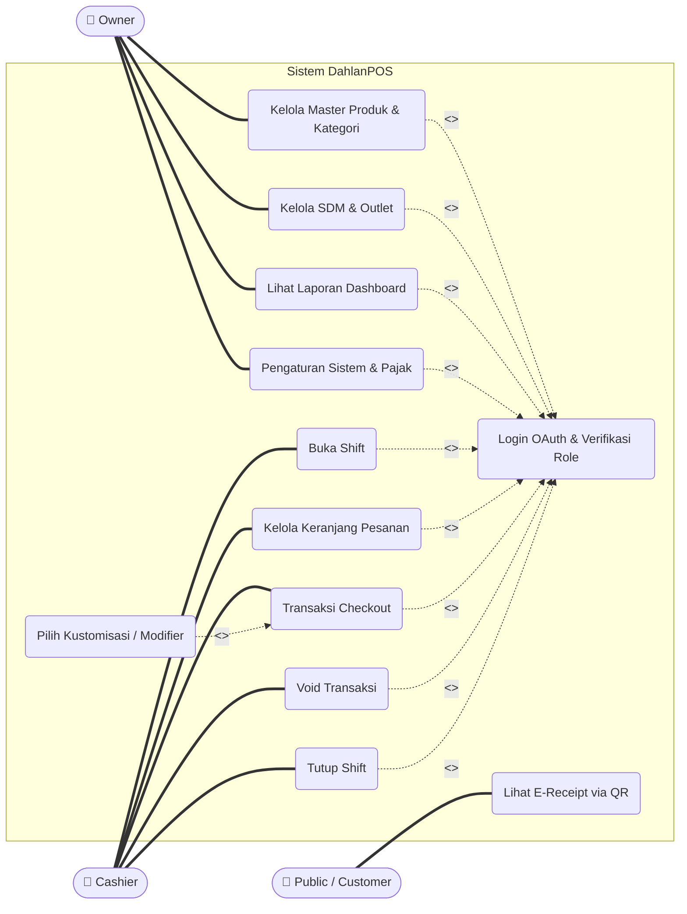

# Use Case Diagram — DahlanPOS

Dokumen ini berisi pemodelan **Use Case Diagram** untuk sistem DahlanPOS. Pemodelan ini dibuat dengan mengikuti konvensi profesional UML (terdapat *Actor*, *System Boundary*, relasi *Association*, *Include*, dan *Extend*).

Disediakan dua format:
1. **Mermaid JS:** Untuk *preview* visual langsung di dalam file Markdown ini.
2. **PlantUML:** Teks raw yang paling optimal untuk di-*copy-paste* langsung ke dalam **Draw.io** (`Arrange ➔ Insert ➔ Advanced ➔ PlantUML`).

---

## 1. Visual Preview (Mermaid)

> **Catatan:** Mermaid menggunakan bentuk "Flowchart" untuk mensimulasikan Use Case Diagram. Bentuk oval merepresentasikan *Use Case*, dan kotak dengan ikon 👤 merepresentasikan *Actor*.



---

## 2. Source Code untuk Draw.io (PlantUML)

Sintaks di bawah ini adalah format resmi PlantUML yang **sangat disarankan** untuk Anda *import* ke **Draw.io**. Hasil render Draw.io akan menghasilkan bentuk ikon orang asli (Actor) dan oval standar UML yang sangat rapi.

**Cara Penggunaan di Draw.io:**
1. Buka halaman kanvas Draw.io
2. Pilih menu **Arrange** ➔ **Insert** ➔ **Advanced** ➔ **PlantUML...**
3. *Copy* seluruh blok kode di bawah ini (tanpa backticks) dan *Paste* ke dalam popup tersebut.

```text
@startuml
left to right direction
skinparam packageStyle rectangle

actor "Owner" as owner
actor "Cashier" as cashier
actor "Public/Customer" as public

rectangle "Sistem DahlanPOS" {
  usecase "Login OAuth & Verifikasi Role" as UC_Login
  
  usecase "Buka Shift" as UC_OpenShift
  usecase "Tutup Shift" as UC_CloseShift
  usecase "Kelola Keranjang Pesanan" as UC_Cart
  usecase "Transaksi Checkout" as UC_Checkout
  usecase "Void Transaksi" as UC_Void
  
  usecase "Kelola Master Produk & Kategori" as UC_Catalog
  usecase "Kelola SDM & Outlet" as UC_HR
  usecase "Lihat Laporan Dashboard" as UC_Reports
  usecase "Pengaturan Sistem & Pajak" as UC_Settings

  usecase "Lihat E-Receipt via QR" as UC_Receipt
  
  usecase "Pilih Kustomisasi / Modifier" as UC_Modifier
}

owner --> UC_Catalog
owner --> UC_HR
owner --> UC_Reports
owner --> UC_Settings

cashier --> UC_OpenShift
cashier --> UC_Cart
cashier --> UC_Checkout
cashier --> UC_Void
cashier --> UC_CloseShift

public --> UC_Receipt

UC_OpenShift .> UC_Login : <<include>>
UC_Cart .> UC_Login : <<include>>
UC_Checkout .> UC_Login : <<include>>
UC_Void .> UC_Login : <<include>>
UC_CloseShift .> UC_Login : <<include>>

UC_Catalog .> UC_Login : <<include>>
UC_HR .> UC_Login : <<include>>
UC_Reports .> UC_Login : <<include>>
UC_Settings .> UC_Login : <<include>>

UC_Modifier .> UC_Checkout : <<extend>>

@enduml
```

---

## 3. Penjelasan / Representasi Teks (Sesuai Konvensi UML)

Untuk dilampirkan dalam bab laporan (sebagai deskripsi pengiring diagram), Anda bisa menggunakan penjelasan berikut:

### 3.1 Identifikasi Aktor (Actors)
Aktor adalah entitas yang berinteraksi langsung dengan sistem. Pada DahlanPOS terdapat 3 aktor utama:
1. **Owner:** Aktor yang memiliki hak akses penuh terhadap modul Backoffice. Bertugas mengelola data master (produk, kategori, SDM, outlet), melihat laporan penjualan, dan mengatur konfigurasi sistem (pajak).
2. **Cashier:** Aktor operasional yang bertanggung jawab melayani transaksi harian. Bertugas membuka dan menutup shift, mengelola keranjang pesanan, melakukan *checkout*, dan melakukan *void* (pembatalan transaksi). Akses Cashier dibatasi secara ketat berdasarkan `outlet_id` miliknya.
3. **Public / Customer:** Aktor non-autentikasi yang mengakses sistem dari luar (melalui scan QR code pada struk fisik) hanya untuk melihat *E-Receipt* transaksi miliknya.

### 3.2 Relasi dan Spesifikasi Use Case
1. **Sistem Boundary:** Seluruh proses yang terjadi dari manajemen inventaris hingga transaksi dibatasi di dalam ruang lingkup *"Sistem DahlanPOS"*.
2. **Relasi Association:** Menunjukkan interaksi langsung.
   - Owner terhubung ke fungsi manajerial (Kelola Master Produk, SDM, Laporan).
   - Cashier terhubung ke fungsi transaksional (Buka Shift, Transaksi Checkout, Void).
   - Public terhubung ke Lihat E-Receipt.
3. **Relasi `<<include>>` (Ketergantungan Wajib):**
   - Hampir seluruh *Use Case* Owner dan Cashier memiliki relasi `<<include>>` menuju *Use Case* **"Login OAuth & Verifikasi Role"**. Ini berarti, sebelum Owner atau Cashier bisa mengakses fitur apa pun di dalam sistem (baik itu buka shift maupun kelola produk), mereka **wajib** melewati fungsi Login terlebih dahulu.
4. **Relasi `<<extend>>` (Fungsi Opsional):**
   - Terdapat fungsi opsional **"Pilih Kustomisasi / Modifier"** yang memiliki relasi `<<extend>>` menuju **"Transaksi Checkout"**. Ini berarti saat kasir memasukkan pesanan, fungsionalitas memodifikasi pesanan (misal: *Less Sugar*, *Large Size*) bisa dipanggil, tetapi sifatnya tidak wajib (tergantung apakah produk tersebut diatur memiliki modifier atau tidak).
