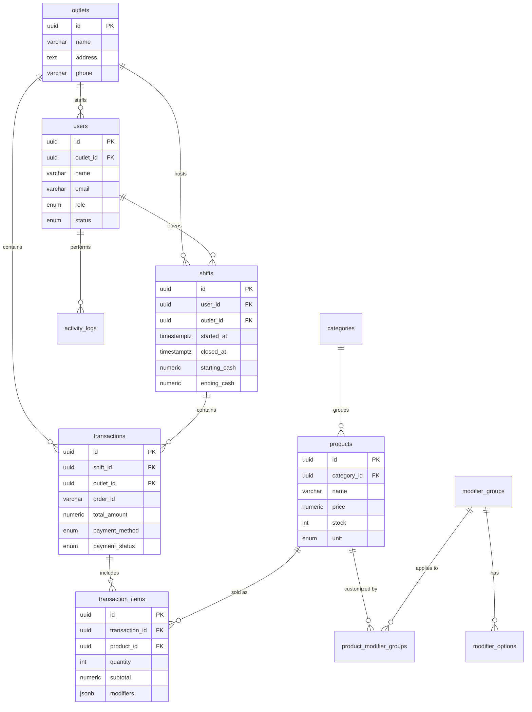

# PROPOSAL PROYEK
# SMALL THINGS COFFEE POS (DahlanPOS)
# *Sistem Point of Sale Berbasis Web untuk Bisnis F&B Multi-Outlet*

---

<div align="center">

**Diajukan Kepada:**
<!-- [PLACEHOLDER: Nama Dosen Pembimbing / Nama Klien / Nama Instansi] -->

**Disusun Oleh:**
<!-- [PLACEHOLDER: Nama Lengkap Tim / Nama Perusahaan Pengembang] -->

**Program Studi Informatika**
<!-- [PLACEHOLDER: Nama Universitas] -->

**Tanggal Pengajuan:**
April 2026

</div>

---

## LEMBAR PENGESAHAN

| | |
|---|---|
| **Nama Proyek** | Small Things Coffee POS (DahlanPOS) |
| **Jenis Proyek** | Pengembangan Aplikasi Web — Capstone / Proyek Akhir S1 |
| **Klien / Mitra** | <!-- [PLACEHOLDER: Nama Klien / Mitra Bisnis] --> |
| **Tanggal Mulai** | <!-- [PLACEHOLDER: dd MMM YYYY] --> |
| **Tanggal Selesai (Target)** | <!-- [PLACEHOLDER: dd MMM YYYY] --> |

<br/>

Proposal ini telah disetujui dan disahkan oleh pihak-pihak berikut:

| Nama | Jabatan | Tanda Tangan | Tanggal |
|---|---|---|---|
| <!-- [Nama Dosen Pembimbing] --> | Dosen Pembimbing | __________ | __________ |
| <!-- [Nama Ketua Tim] --> | Ketua Tim Pengembang | __________ | __________ |
| <!-- [Nama Perwakilan Klien] --> | Perwakilan Klien | __________ | __________ |

---

## RINGKASAN EKSEKUTIF

**Small Things Coffee POS** (selanjutnya disebut **DahlanPOS**) adalah aplikasi kasir berbasis web yang dirancang khusus untuk bisnis makanan dan minuman yang memiliki satu atau lebih cabang. Sistem ini dikembangkan sebagai proyek akhir (capstone) Program Studi Informatika dan secara bersamaan menjawab kebutuhan nyata operasional bisnis kedai kopi skala menengah.

**Masalah inti yang diselesaikan:** Banyak pelaku usaha F&B skala kecil hingga menengah masih bergantung pada pencatatan manual atau aplikasi kasir berbayar yang biayanya memberatkan. DahlanPOS hadir sebagai solusi yang dapat digunakan secara gratis, mudah dipasang, dan dapat dikustomisasi sesuai kebutuhan spesifik usaha.

**Solusi yang ditawarkan:** Aplikasi dengan dua modul utama — **Manajemen (Backoffice)** untuk pemilik usaha, dan **Kasir** untuk staf operasional. Sistem ini menangani pengelolaan produk, stok, shift kerja kasir, transaksi penjualan, dan laporan keuangan harian secara otomatis.

**Platform:** Aplikasi berbasis web — dapat digunakan di komputer atau tablet melalui browser, tanpa perlu instalasi aplikasi khusus.

**Target penyelesaian:** <!-- [PLACEHOLDER: durasi, mis. "14 minggu"] --> dengan total estimasi anggaran Rp <!-- [PLACEHOLDER: total anggaran] -->.

---

## DAFTAR ISI

1. [BAB 1 — Pendahuluan](#bab-1--pendahuluan)
2. [BAB 2 — Profil Tim Pengembang](#bab-2--profil-tim-pengembang)
3. [BAB 3 — Analisis Proyek](#bab-3--analisis-proyek)
4. [BAB 4 — Perencanaan Proyek (Project Charter)](#bab-4--perencanaan-proyek-project-charter)
5. [BAB 5 — Work Breakdown Structure (WBS)](#bab-5--work-breakdown-structure-wbs)
6. [BAB 6 — Jadwal Pelaksanaan](#bab-6--jadwal-pelaksanaan)
7. [BAB 7 — Responsibility Matrix (RACI)](#bab-7--responsibility-matrix-raci)
8. [BAB 8 — Anggaran Biaya (RAB)](#bab-8--anggaran-biaya-rab)
9. [BAB 9 — Tanggung Jawab Para Pihak](#bab-9--tanggung-jawab-para-pihak)
10. [Penutup](#penutup)
11. [Daftar Pustaka](#daftar-pustaka)
12. [Lampiran](#lampiran)

---

---

# BAB 1 — PENDAHULUAN

## 1.1 Latar Belakang

Perkembangan teknologi informasi dan komunikasi yang pesat di era digital saat ini telah membawa transformasi besar pada berbagai sektor industri, tidak terkecuali pada industri Food & Beverage (F&B). Di Indonesia, industri F&B terus menunjukkan tren pertumbuhan yang positif, didorong oleh perubahan gaya hidup masyarakat dan tingginya minat terhadap budaya nongkrong, khususnya di kedai kopi. Kedai kopi modern kini bukan hanya tempat untuk menikmati minuman, tetapi juga berfungsi sebagai ruang sosial, tempat bekerja, dan berkumpul. Seiring dengan pertumbuhan jumlah kedai kopi, tingkat persaingan pun semakin ketat. Hal ini menuntut para pelaku usaha, khususnya pada skala Usaha Mikro, Kecil, dan Menengah (UMKM), untuk terus meningkatkan efisiensi operasional dan kualitas pelayanan demi mempertahankan kelangsungan bisnisnya.

Salah satu elemen krusial dalam operasional bisnis F&B adalah sistem kasir atau Point of Sale (POS). Sistem POS tidak hanya berfungsi sebagai mesin kasir elektronik untuk mencatat transaksi penjualan, tetapi juga sebagai pusat kendali operasional harian yang mencakup manajemen stok inventaris, pengelolaan shift karyawan, serta pencatatan arus kas. Sayangnya, banyak pelaku usaha kedai kopi skala kecil hingga menengah yang masih terjebak dalam metode pencatatan manual menggunakan buku kas atau menggunakan mesin kasir konvensional tanpa fitur analitik. Metode tradisional ini sangat rentan terhadap *human error*, membutuhkan waktu lama untuk proses rekapitulasi data di akhir hari kerja, serta menyulitkan pemilik usaha dalam melakukan pemantauan stok secara *real-time*. Dampaknya, sering terjadi selisih antara uang kas dan laporan penjualan, kebocoran inventaris, serta keterlambatan dalam pengambilan keputusan bisnis karena tidak tersedianya data yang akurat dan cepat.

Di sisi lain, meskipun saat ini telah banyak bermunculan aplikasi kasir digital atau POS komersial berbasis *cloud*, penggunaannya seringkali tidak sejalan dengan kemampuan finansial dan kebutuhan spesifik UMKM. Aplikasi POS komersial umumnya menetapkan skema berlangganan bulanan atau tahunan dengan biaya yang cukup membebani biaya operasional (OPEX) usaha kecil. Selain itu, fitur-fitur yang ditawarkan terkadang terlalu kompleks dan tidak relevan, atau sebaliknya, kurang fleksibel untuk dikustomisasi sesuai dengan alur kerja (SOP) spesifik dari kedai kopi tersebut. Keterbatasan lain yang sering dikeluhkan adalah sulitnya integrasi untuk bisnis yang mulai berkembang dan memiliki lebih dari satu cabang (multi-outlet), di mana fitur sinkronisasi antar cabang biasanya mengharuskan pemilik usaha untuk melakukan *upgrade* ke paket berlangganan yang lebih mahal.

Merespons tantangan dan celah dalam ketersediaan sistem yang terjangkau serta fungsional tersebut, muncul kebutuhan akan sebuah sistem POS yang efisien, andal, dan dapat diakses tanpa biaya berlangganan yang memberatkan. Oleh karena itu, diusulkanlah pengembangan **Small Things Coffee POS** (selanjutnya disebut **DahlanPOS**). DahlanPOS dirancang sebagai aplikasi Point of Sale berbasis web yang *open-source* atau *self-hosted*, yang ditujukan khusus untuk memberikan solusi digitalisasi operasional bagi bisnis F&B skala menengah ke bawah. Dengan mengusung arsitektur berbasis web, sistem ini menawarkan fleksibilitas tinggi karena dapat diakses melalui berbagai perangkat (komputer, laptop, maupun tablet) yang sudah dimiliki oleh pelaku usaha, tanpa memerlukan investasi perangkat keras khusus yang mahal. 

Pengembangan DahlanPOS tidak hanya bertujuan untuk mendigitalkan proses pencatatan transaksi agar lebih cepat dan presisi, tetapi juga untuk menyediakan ekosistem pengelolaan yang komprehensif. Fitur manajemen multi-outlet akan memungkinkan pemilik bisnis memantau performa penjualan, ketersediaan stok, dan kinerja kasir di setiap cabangnya secara *real-time* melalui satu dasbor terpusat. Dengan adanya sistem pelaporan dan manajemen operasional yang transparan dan terotomatisasi ini, diharapkan pemilik usaha dapat mengurangi risiko kerugian finansial, meningkatkan produktivitas karyawan, dan pada akhirnya dapat berfokus pada inovasi produk serta ekspansi bisnis. Pengembangan sistem ini sekaligus menjadi implementasi nyata dari penerapan teknologi informasi untuk memberdayakan UMKM agar lebih berdaya saing di era ekonomi digital.

## 1.2 Identifikasi Masalah

Berdasarkan observasi dan wawancara awal dengan pengelola <!-- [PLACEHOLDER: Nama Mitra/Klien] -->, diidentifikasi masalah-masalah berikut:

| No. | Masalah | Dampak |
|---|---|---|
| P1 | Pencatatan transaksi masih dilakukan secara manual | Rentan kesalahan, lambat, tidak ada audit trail |
| P2 | Tidak ada sistem manajemen stok yang terintegrasi | Stok habis tidak terdeteksi, kerugian penjualan |
| P3 | Laporan penjualan harian harus direkap manual | Memakan waktu, data tidak real-time, potensi manipulasi |
| P4 | Manajemen shift kasir tidak terstruktur | Tidak ada rekap modal awal/akhir, selisih kas tidak tercatat |
| P5 | Pengelolaan outlet yang lebih dari satu cabang tidak terpusat | Data cabang tidak terintegrasi, owner tidak bisa memonitor dari satu tempat |
| P6 | Biaya aplikasi POS komersial terlalu tinggi untuk skala UMKM | Beban operasional bertambah, sulit scale-up |

## 1.3 Tujuan Proyek

Tujuan pengembangan **Small Things Coffee POS** adalah:

1. **T1 — Digitalisasi Operasional Kasir:** Membangun aplikasi kasir berbasis web yang memungkinkan proses penjualan dilakukan secara digital, cepat, dan bebas dari kesalahan pencatatan manual.
2. **T2 — Manajemen Stok Otomatis:** Menyediakan sistem yang secara otomatis mengurangi jumlah stok setiap kali terjadi penjualan, sehingga kasir dan pemilik selalu mengetahui ketersediaan item secara akurat.
3. **T3 — Manajemen Shift Terstruktur:** Menyediakan fitur buka dan tutup shift kasir yang mencatat modal awal, total pendapatan, dan selisih kas secara transparan dan dapat diverifikasi kapan saja.
4. **T4 — Pelaporan Terpusat untuk Pemilik:** Menyediakan halaman laporan dan ringkasan penjualan yang dapat diakses pemilik dari mana saja, mencakup semua cabang sekaligus.
5. **T5 — Biaya Operasional Nol:** Merancang sistem yang dapat berjalan tanpa biaya layanan bulanan, sehingga dapat dimanfaatkan oleh usaha kecil dan menengah tanpa beban finansial tambahan.
6. **T6 — Mudah Dipasang & Digunakan Kembali:** Menghasilkan sistem yang lengkap dengan panduan penggunaan, sehingga dapat dipasang dan dioperasikan secara mandiri oleh pihak lain tanpa bantuan tim pengembang.

## 1.4 Manfaat Proyek

### Manfaat bagi Klien / Mitra Bisnis:
- Proses transaksi harian menjadi lebih cepat, akurat, dan bebas dari risiko kesalahan pencatatan.
- Data penjualan, stok, dan laporan shift tersedia secara langsung tanpa perlu rekap manual di akhir hari.
- Pemilik usaha dapat memantau kinerja semua cabang dari satu tempat, kapan saja dan di mana saja.
- Tidak ada biaya berlangganan bulanan — penghematan langsung dibandingkan aplikasi kasir komersial.

### Manfaat bagi Tim Pengembang (Akademik):
- Pengalaman nyata membangun sistem perangkat lunak yang digunakan oleh bisnis sungguhan.
- Portofolio proyek aktif yang dapat didemonstrasikan kepada calon pemberi kerja.
- Pemahaman mendalam tentang perancangan sistem informasi bisnis dan pengembangan perangkat lunak profesional.

### Manfaat bagi Masyarakat / Ekosistem:
- Solusi yang dapat diadopsi dan dikembangkan lebih lanjut oleh pelaku UMKM F&B Indonesia lainnya.
- Referensi nyata bagi mahasiswa dan pengembang yang ingin membangun sistem kasir serupa.

## 1.5 Ruang Lingkup (Scope)

### Dalam Lingkup (In-Scope):

| Modul | Fitur yang Dikembangkan |
|---|---|
| **Login & Keamanan** | Masuk menggunakan akun Google, pembagian hak akses antara Pemilik dan Kasir |
| **Halaman Utama Pemilik** | Ringkasan penjualan real-time, filter per cabang dan tanggal |
| **Katalog Produk** | Kelola kategori, produk (beserta foto), dan pilihan kustomisasi pesanan (mis. ukuran, topping) |
| **Manajemen Karyawan** | Tambah, nonaktifkan, dan atur akses karyawan per cabang |
| **Manajemen Cabang** | Tambah dan kelola data lokasi cabang |
| **Laporan** | Laporan transaksi dan laporan shift kasir lengkap dengan filter |
| **Pengaturan Toko** | Atur pajak, metode pembayaran yang diterima, dan teks yang tampil di struk |
| **Kasir — Shift** | Buka dan tutup shift dengan pencatatan modal awal dan rekap akhir |
| **Kasir — Penjualan** | Pilih menu, atur pesanan, pilih metode bayar (tunai atau QRIS) |
| **Kasir — Transaksi** | Lihat riwayat transaksi, batalkan transaksi jika diperlukan, cetak struk digital |
| **Sistem Otomatis** | Stok berkurang otomatis setelah transaksi, log aktivitas karyawan tercatat |

### Di Luar Lingkup (Out-of-Scope):

- Konfirmasi pembayaran QRIS dilakukan secara manual oleh kasir — **tidak ada integrasi otomatis dengan penyedia QRIS.**
- Program loyalitas pelanggan (poin, diskon member).
- Aplikasi khusus ponsel (Android / iPhone) — sistem cukup diakses melalui browser.
- Laporan akuntansi lanjutan seperti neraca atau laporan laba-rugi.
- Manajemen pembelian bahan baku dari pemasok.
- Sistem yang digunakan oleh lebih dari satu bisnis/pemilik yang berbeda secara bersamaan.

## 1.6 Batasan dan Asumsi

### Batasan:
- Sistem dirancang untuk digunakan oleh **maksimal 5–10 pengguna secara bersamaan** (1 Pemilik dan sejumlah Kasir).
- Untuk masuk ke sistem, setiap karyawan **wajib memiliki akun Google** (Gmail) yang sudah didaftarkan terlebih dahulu oleh Pemilik — tidak ada pendaftaran mandiri.
- Pembayaran QRIS **diverifikasi secara visual oleh kasir** (melihat notifikasi di ponsel pembeli), lalu dikonfirmasi di aplikasi — bukan oleh mesin secara otomatis.
- Sistem menggunakan layanan cloud gratis. Jika aplikasi tidak diakses dalam beberapa waktu, **mungkin diperlukan beberapa detik saat pertama kali dibuka kembali** sebelum siap digunakan.

### Asumsi:
- Setiap karyawan yang akan menggunakan sistem sudah memiliki akun Google (Gmail) yang aktif.
- Pemilik bersedia melakukan satu kali konfigurasi awal layanan autentikasi Google (dipandu oleh tim pengembang).
- Perangkat yang digunakan untuk kasir (komputer atau tablet) memiliki browser yang terbaru (Google Chrome atau Microsoft Edge direkomendasikan).
- Tim pengembang menggunakan perangkat dengan kapasitas memadai untuk keperluan pembangunan sistem.

---

---

# BAB 2 — PROFIL TIM PENGEMBANG

## 2.1 Deskripsi Tim

<!-- [PLACEHOLDER: Deskripsi singkat tentang tim/perusahaan pengembang. Contoh: "Tim pengembang terdiri dari mahasiswa Program Studi Informatika Semester X yang tergabung dalam kelompok capstone project. Tim ini berfokus pada pengembangan aplikasi web full-stack dengan spesialisasi di bidang sistem informasi bisnis."] -->

Tim pengembang DahlanPOS berkomitmen untuk menghasilkan sistem yang berkualitas, andal, dan mudah dikembangkan lebih lanjut di masa mendatang.

## 2.2 Struktur Tim & Peran

| No. | Nama | NIM | Peran | Tanggung Jawab Utama |
|---|---|---|---|---|
| 1 | M Fauzan Pradipta Dimas C | 2300018427 | **Project Manager** | Koordinasi tim, komunikasi dengan klien dan pembimbing, pengawasan kualitas keseluruhan |
| 2 | Anggasta Vyaktatama Kahfi | 2300018434 | **Fullstack Engineer** | Pembangunan logika bisnis sisi server dan pengembangan antarmuka pengguna |
| 3 | M Reyhan Panji Banuraga | 2300018439 | **UI/UX Designer** | Perancangan tampilan dan pengalaman pengguna aplikasi |
| 4 | *(akan dilengkapi)* | *(akan dilengkapi)* | **Technical Writer** | Penyusunan dokumentasi teknis, panduan pengguna, dan laporan proyek |
| 5 | *(akan dilengkapi)* | *(akan dilengkapi)* | **Quality Assurance** | Pengujian sistem secara menyeluruh, pelaporan bug, dan validasi penerimaan |

> **Catatan:** Jumlah dan komposisi anggota tim dapat disesuaikan. Pada tim kecil (2–3 orang), peran dapat digabung.

## 2.3 Kompetensi Teknis Tim

| Bidang Keahlian | Level |
|---|---|
| Pemrograman sisi server (Go/Golang) | ⬛⬛⬛⬛⬜ Mahir |
| Pemrograman antarmuka web (Next.js / React) | ⬛⬛⬛⬛⬜ Mahir |
| Manajemen basis data (PostgreSQL) | ⬛⬛⬛⬛⬜ Mahir |
| Pengelolaan server & deployment | ⬛⬛⬛⬜⬜ Menengah |
| Perancangan API layanan web | ⬛⬛⬛⬛⬛ Sangat Mahir |
| Manajemen versi kode (Git) | ⬛⬛⬛⬛⬛ Sangat Mahir |

---

---

# BAB 3 — ANALISIS PROYEK

## 3.1 Analisis Kebutuhan Fungsional

Sistem ini memiliki dua peran pengguna utama:

| ID | Peran | Deskripsi Hak Akses |
|---|---|---|
| R1 | **Pemilik (Owner)** | Akses penuh ke seluruh modul Backoffice dan Kasir. Dapat mengelola semua outlet, karyawan, produk, dan melihat laporan konsolidasi. |
| R2 | **Kasir (Cashier)** | Akses terbatas pada modul Kasir saja. Terkunci pada satu outlet yang ditugaskan. Dapat melakukan penjualan, shift, dan melihat riwayat transaksi lokal. |

### Modul 1: Login & Keamanan Akses

| ID | Fitur | Deskripsi |
|---|---|---|
| F1.1 | Masuk dengan Akun Google | Pengguna login menggunakan akun Google yang sudah dimiliki — tanpa perlu membuat username dan password baru. |
| F1.2 | Verifikasi Karyawan Terdaftar | Sistem memastikan hanya email yang sudah didaftarkan oleh pemilik yang dapat mengakses aplikasi. |
| F1.3 | Sesi Login Aman & Otomatis Berakhir | Setelah login berhasil, sistem secara otomatis menjaga sesi pengguna dan menutupnya setelah periode tidak aktif. |
| F1.4 | Dua Mode Login Bersamaan | Pemilik dapat membuka tampilan manajemen dan tampilan kasir secara bersamaan di dua tab browser yang berbeda. |

### Modul 2: Manajemen (Backoffice — khusus Pemilik)

| ID | Fitur | Deskripsi |
|---|---|---|
| F2.1 | Dasbor Penjualan | Ringkasan pendapatan, jumlah transaksi, dan rata-rata nilai pesanan — bisa difilter per cabang dan rentang tanggal. |
| F2.2 | Kelola Kategori | Tambah, ubah, dan hapus pengelompokan menu (contoh: Kopi, Makanan Ringan). |
| F2.3 | Kelola Pilihan Kustomisasi | Atur opsi pilihan tambahan pada pesanan (contoh: Ukuran — Kecil/Besar, Gula — Sedikit/Normal). |
| F2.4 | Kelola Produk | Tambah dan ubah data menu: nama, harga, stok, foto produk, status aktif, dan penandaan favorit. |
| F2.5 | Kelola Karyawan | Daftarkan akun karyawan, atur jabatan, dan nonaktifkan akses secara instan jika diperlukan. |
| F2.6 | Log Aktivitas | Rekam jejak semua aktivitas karyawan di sistem (siapa melakukan apa dan kapan). |
| F2.7 | Kelola Cabang | Tambah dan ubah informasi lokasi cabang usaha. |
| F2.8 | Laporan Transaksi | Daftar lengkap semua penjualan dengan opsi filter tanggal, cabang, dan jenis pembayaran. |
| F2.9 | Laporan Shift | Rekap kinerja kasir per shift, termasuk perbandingan uang tunai yang seharusnya ada versus yang tercatat. |
| F2.10 | Pengaturan Toko | Atur jenis pembayaran yang diterima, persentase pajak, serta teks yang tampil di struk pelanggan. |

### Modul 3: Kasir (Operasional Harian)

| ID | Fitur | Deskripsi |
|---|---|---|
| F3.1 | Buka Shift | Kasir memasukkan jumlah uang tunai awal sebelum mulai melayani pelanggan. |
| F3.2 | Ringkasan Shift Berjalan | Kasir dapat melihat total penjualan tunai dan QRIS yang sudah terjadi selama shift ini. |
| F3.3 | Tutup Shift | Kasir memasukkan uang tunai di akhir shift; sistem langsung menghitung selisih dan memintanya dicatat. |
| F3.4 | Telusuri Menu | Kasir dapat browsing menu berdasarkan tab kategori, dilengkapi foto dan harga produk. |
| F3.5 | Keranjang Pesanan | Tambah menu ke keranjang, ubah jumlah, atau hapus item sebelum diproses. |
| F3.6 | Pilihan Kustomisasi Pesanan | Jika produk memiliki opsi tambahan (mis. topping, ukuran), sistem akan menampilkan pilihan sebelum masuk ke keranjang. |
| F3.7 | Pembayaran Tunai | Kasir memasukkan nominal uang yang diterima; sistem langsung menghitung kembalian. |
| F3.8 | Pembayaran QRIS | Kasir memastikan pembayaran dari pelanggan sudah masuk, lalu mengonfirmasi di aplikasi. |
| F3.9 | Pengurangan Stok Otomatis | Begitu transaksi selesai, stok produk yang terjual langsung berkurang di sistem secara otomatis. |
| F3.10 | Struk Digital | Pelanggan dan kasir mendapatkan struk yang bisa dicetak maupun dibagikan melalui tautan QR. |
| F3.11 | Riwayat & Pembatalan Transaksi | Lihat transaksi yang sudah terjadi dan batalkan (void) jika ada kesalahan — semua tercatat dengan jejak audit. |

## 3.2 Analisis Kebutuhan Non-Fungsional

| Kategori | Kebutuhan | Standar / Target |
|---|---|---|
| **Kecepatan Respons** | Operasi umum (tambah, ubah, hapus data) | Selesai dalam < 1 detik |
| **Kecepatan Respons** | Memuat halaman menu kasir | Selesai dalam < 2 detik |
| **Kecepatan Respons** | Membuka laporan penjualan | Selesai dalam < 5 detik |
| **Kapasitas Pengguna** | Jumlah pengguna aktif bersamaan | 5–10 pengguna (1 Pemilik + beberapa Kasir) |
| **Keamanan — Login** | Metode autentikasi | Akun Google resmi + token keamanan terenkripsi |
| **Keamanan — Hak Akses** | Pembatasan akses per peran | Pemilik dan Kasir hanya bisa mengakses fitur yang sesuai jabatannya |
| **Keamanan — Data** | Perlindungan dari manipulasi data | Seluruh pertukaran data antara aplikasi dan server divalidasi dan dienkripsi |
| **Keamanan — Jaringan** | Pembatasan akses eksternal | Hanya aplikasi resmi yang dapat berkomunikasi dengan server |
| **Keandalan Data** | Konsistensi saat terjadi transaksi | Stok dan data keuangan tidak bisa kacau meski dua kasir melakukan transaksi bersamaan |
| **Kemudahan Pemasangan** | Cara menjalankan sistem | Seluruh sistem dapat dijalankan dalam satu langkah dari panduan instalasi |
| **Kompatibilitas** | Sistem operasi yang didukung | Dapat berjalan di Windows, macOS, dan Linux |
| **Kemudahan Pengembangan** | Struktur kode | Terorganisir dengan baik, bisa dikembangkan dan dipelajari oleh developer lain |
| **Skalabilitas** | Model kapasitas | Dirancang untuk skala UMKM; tidak memerlukan server besar |
| **Ketersediaan Layanan** | Target uptime | ~99% (pemakaian gratis; bisa ada jeda beberapa detik setelah tidak aktif lama) |

## 3.3 Analisis Risiko

| ID | Risiko | Probabilitas | Dampak | Skor | Mitigasi |
|---|---|---|---|---|---|
| R01 | Aplikasi terasa lambat saat pertama diakses setelah lama tidak digunakan (efek layanan hosting gratis) | Tinggi | Menengah | 🟡 Tinggi | Buka aplikasi 2–3 menit sebelum demo atau jam operasional untuk "memanaskan" server |
| R02 | Layanan login Google memerlukan konfigurasi ulang (mis. kunci akses kedaluwarsa) | Rendah | Tinggi | 🟡 Menengah | Dokumentasikan langkah konfigurasi ulang, simpan salinan pengaturan di tempat aman |
| R03 | Dua kasir memproses item yang sama secara bersamaan sehingga stok bisa minus | Rendah | Tinggi | 🟡 Menengah | Sistem dilengkapi mekanisme pengamanan agar transaksi bersamaan tetap akurat |
| R04 | Data hilang akibat kerusakan pada server/penyimpanan aplikasi | Sangat Rendah | Sangat Tinggi | 🟡 Menengah | Lakukan pencadangan data (backup) secara rutin; prosedur pemulihan didokumentasikan |
| R05 | Anggota tim tidak aktif atau mengundurkan diri di tengah proyek | Menengah | Tinggi | 🔴 Tinggi | Setiap fitur didokumentasikan segera selesai dibuat; pengetahuan dibagi antar anggota tim |
| R06 | Pengerjaan fitur membutuhkan waktu lebih lama dari estimasi | Menengah | Menengah | 🟡 Menengah | Jadwal diberi waktu cadangan 10–15% per tahap; kemajuan ditinjau setiap minggu |
| R07 | Kapasitas penyimpanan foto produk di layanan gratis terlalu penuh | Sangat Rendah | Rendah | 🟢 Rendah | Foto produk dikecilkan ukurannya sebelum diunggah; penggunaan dipantau secara berkala |
| R08 | Tampilan aplikasi tidak sempurna di perangkat atau browser lama | Rendah | Menengah | 🟢 Rendah | Pastikan perangkat kasir menggunakan Chrome atau Edge versi terbaru |

> **Skala Skor:** 🟢 Rendah | 🟡 Menengah | 🔴 Tinggi | ⛔ Kritis

## 3.4 Metodologi Pengembangan

Proyek ini mengadopsi metodologi **Iterative + Agile (Modified Scrum)** dengan sprint 1–2 minggu per iterasi.

**Alasan pemilihan metodologi:**
1. **Kompleksitas modular** — Sistem terdiri dari banyak modul independen (Auth, Backoffice, Kasir) yang dapat dikembangkan secara paralel.
2. **Kebutuhan validasi bertahap** — Fitur kasir (modul kritis) perlu diuji dengan simulasi kasir nyata lebih awal, bukan di akhir proyek.
3. **Tim kecil & fleksibel** — Scrum penuh terlalu overhead untuk tim ≤4 orang; versi ringan (sprint planning + review) lebih efisien.
4. **Kemungkinan perubahan requirement** — Feedback dari klien setelah melihat prototype awal memungkinkan penyesuaian cepat tanpa membuang banyak pekerjaan.

**Artefak Scrum yang Digunakan:**
- **Sprint Planning** — setiap awal sprint
- **Sprint Review** — demo ke klien/pembimbing setiap akhir sprint
- **Sprint Retrospective** — evaluasi internal tim
- **Product Backlog** — daftar fitur yang diprioritaskan

---

---

# BAB 4 — PERENCANAAN PROYEK (PROJECT CHARTER)

## 4.1 Nama & Deskripsi Proyek

| | |
|---|---|
| **Nama Proyek** | Small Things Coffee POS (DahlanPOS) |
| **Singkatan** | DahlanPOS |
| **Jenis Produk** | Aplikasi kasir berbasis web |
| **Deskripsi** | Sistem kasir digital gratis untuk bisnis F&B dengan satu atau lebih cabang, menyediakan fitur manajemen terpusat untuk pemilik dan antarmuka kasir yang mudah digunakan untuk staf operasional. |
| **Versi Target** | v1.0.0 (Rilis Pertama Stabil) |

## 4.2 Tujuan & Deliverables

| Tujuan | Hasil yang Diserahkan | Kriteria Penerimaan |
|---|---|---|
| T1 — Digitalisasi Kasir | Aplikasi kasir yang berfungsi penuh | Staf kasir dapat menyelesaikan seluruh proses penjualan dari awal hingga struk dicetak |
| T2 — Manajemen Stok | Sistem pengurangan stok otomatis | Stok berkurang tepat sesuai jumlah yang terjual; penjualan item habis tidak bisa diproses |
| T3 — Manajemen Shift | Fitur buka dan tutup shift kasir | Selisih kas terhitung dan tercatat secara otomatis di laporan shift |
| T4 — Pelaporan Pemilik | Dasbor dan laporan penjualan multi-cabang | Pemilik dapat menyaring laporan per cabang dan per rentang tanggal |
| T5 — Tanpa Biaya Bulanan | Sistem aktif di internet tanpa biaya operasional | Aplikasi dapat diakses melalui tautan publik tanpa tagihan layanan bulanan |
| T6 — Mudah Dipasang & Diwariskan | Paket sistem lengkap dengan panduan instalasi | Sistem dapat dipasang secara mandiri mengikuti panduan, tanpa memerlukan bantuan tim pengembang |

## 4.3 Pemangku Kepentingan (Stakeholders)

| Pihak | Peran | Keterlibatan |
|---|---|---|
| <!-- [Nama Klien/Mitra] --> | Penerima Layanan / Pemilik Produk | Validasi kebutuhan, pengujian penerimaan, pemberian umpan balik iterasi |
| <!-- [Nama Dosen Pembimbing] --> | Pembimbing Akademik | Tinjauan milestone, penilaian akademik, arahan teknis |
| <!-- [Nama Ketua Tim] --> | Koordinator Proyek | Koordinasi mingguan, pelaporan kemajuan |
| Tim Pengembang (4 orang) | Pelaksana Pengembangan | Mengerjakan seluruh pembangunan sistem |
| Kasir Outlet | Pengguna Akhir (Kasir) | Penguji nyata antarmuka kasir di lapangan |

## 4.4 Kriteria Keberhasilan

Proyek dinyatakan berhasil apabila:

- [ ] Seluruh fitur dalam Ruang Lingkup (Bab 1.5) telah dibangun dan diuji.
- [ ] Pengujian otomatis pada alur kritis (login, shift, transaksi) lulus dengan tingkat keberhasilan ≥ 80%.
- [ ] Sistem dapat dipasang dan dijalankan sepenuhnya mengikuti panduan instalasi.
- [ ] Demo langsung berjalan lancar tanpa gangguan besar di hadapan dosen pembimbing dan klien.
- [ ] Panduan penggunaan dan dokumentasi teknis tersedia lengkap di dalam paket pengiriman.
- [ ] Klien/mitra menyatakan **puas** melalui penandatanganan dokumen penerimaan (UAT sign-off).

## 4.5 Batasan & Ketergantungan

| Tipe | Keterangan |
|---|---|
| **Batasan — Waktu** | Proyek harus selesai dalam <!-- [PLACEHOLDER: X] --> minggu sesuai kalender akademik. |
| **Batasan — Anggaran** | Tidak ada biaya layanan server bulanan; seluruh infrastruktur menggunakan layanan gratis. |
| **Batasan — Tim** | Jumlah pengembang terbatas (maksimal 4 orang). |
| **Ketergantungan — Google** | Pemilik perlu memiliki akun Google dan melakukan konfigurasi awal layanan login (dipandu tim). |
| **Ketergantungan — Layanan Foto** | Diperlukan akun layanan penyimpanan foto gratis (Cloudinary) untuk mengunggah gambar produk. |
| **Ketergantungan — Perangkat** | Tim pengembang memerlukan komputer dengan perangkat lunak teknis tertentu untuk membangun sistem. |
| **Ketergantungan — Persetujuan Desain** | Tampilan awal (mockup) harus disetujui klien sebelum pembangunan dimulai. |

---

---

# BAB 5 — WORK BREAKDOWN STRUCTURE (WBS)

## 5.1 Overview WBS

```
DahlanPOS Project
├── Fase 0: Inisiasi & Perencanaan
│   ├── 0.1 Analisis requirement & wawancara klien
│   ├── 0.2 Penyusunan proposal proyek
│   ├── 0.3 Desain arsitektur sistem
│   ├── 0.4 Desain database (ERD + DDL)
│   └── 0.5 Setup environment & repository
│
├── Fase 1: Core Infrastructure
│   ├── 1.1 Setup Backend (Go/Gin boilerplate + Clean Architecture)
│   ├── 1.2 Setup Database Migrations & Seed Data
│   ├── 1.3 Setup Frontend (Next.js 14 + shadcn/ui)
│   ├── 1.4 Implementasi Google OAuth + JWT Authentication
│   ├── 1.5 RBAC Middleware (Owner & Cashier)
│   └── 1.6 Docker Compose Setup (Multi-service)
│
├── Fase 2: Modul Backoffice
│   ├── 2.1 Dashboard & Metrik Penjualan
│   ├── 2.2 Manajemen Kategori (CRUD)
│   ├── 2.3 Manajemen Modifier Groups & Options (CRUD)
│   ├── 2.4 Manajemen Produk (CRUD + Cloudinary Upload)
│   ├── 2.5 Manajemen Karyawan (CRUD + Status Toggle)
│   ├── 2.6 Manajemen Outlet (CRUD)
│   ├── 2.7 Activity Log Viewer
│   ├── 2.8 Laporan Transaksi (dengan filter)
│   ├── 2.9 Laporan Shift (dengan filter)
│   └── 2.10 Pengaturan Sistem (Pajak, Payment, Struk)
│
├── Fase 3: Modul Kasir (POS)
│   ├── 3.1 Manajemen Shift (Buka & Tutup)
│   ├── 3.2 Menu Navigation (Tab Kategori + Grid Produk)
│   ├── 3.3 Keranjang Belanja (Cart State Management)
│   ├── 3.4 Modifier Selection Modal
│   ├── 3.5 Alur Checkout Tunai (dengan kalkulasi kembalian)
│   ├── 3.6 Alur Checkout QRIS (konfirmasi manual)
│   ├── 3.7 Otomasi Deduct Stok (Atomic Transaction)
│   ├── 3.8 Struk Digital & QR Code
│   └── 3.9 Riwayat Transaksi & Void
│
├── Fase 4: Testing & QA
│   ├── 4.1 Unit Testing (Backend Use Cases)
│   ├── 4.2 Integration Testing (Critical Path: Auth, Shift, Checkout)
│   ├── 4.3 UAT (User Acceptance Testing) bersama klien
│   └── 4.4 Bug Fixing & Polish
│
└── Fase 5: Deployment & Serah Terima
    ├── 5.1 Deployment ke cloud free-tier (Vercel + Railway/Render + Neon)
    ├── 5.2 Konfigurasi environment production
    ├── 5.3 Penulisan README & dokumentasi final
    └── 5.4 Demo & Serah Terima ke Klien
```

## 5.2 Milestone per Fase

| Milestone | Deskripsi | Target Selesai |
|---|---|---|
| **M0** | Proposal disetujui, arsitektur & database difinalisasi, repository ready | Akhir Fase 0 |
| **M1** | Autentikasi Google OAuth berfungsi end-to-end, RBAC aktif, Docker stack jalan | Akhir Fase 1 |
| **M2** | Seluruh modul Backoffice dapat digunakan Owner (CRUD selesai, laporan tersedia) | Akhir Fase 2 |
| **M3** | Alur kasir lengkap: buka shift → checkout → cetak struk → tutup shift | Akhir Fase 3 |
| **M4** | Integration test lulus, UAT complete, 0 critical bugs | Akhir Fase 4 |
| **M5** | Sistem live di URL publik, demo sukses, dokumentasi diserahkan | Akhir Fase 5 |

---

---

# BAB 6 — JADWAL PELAKSANAAN

## 6.1 Gantt Chart

> **Durasi Total:** 14 Minggu | **Mulai:** 16 Maret 2026

| Fase / Kegiatan | M1 | M2 | M3 | M4 | M5 | M6 | M7 | M8 | M9 | M10 | M11 | M12 | M13 | M14 |
|---|:---:|:---:|:---:|:---:|:---:|:---:|:---:|:---:|:---:|:---:|:---:|:---:|:---:|:---:|
| **Fase 0: Inisiasi** | ████ | ████ | | | | | | | | | | | | |
| **Fase 1: Core Infra** | | ████ | ████ | | | | | | | | | | | |
| **Fase 2: Backoffice** | | | ████ | ████ | ████ | | | | | | | | | |
| ↳ 2.1 Dashboard & Laporan | | | ████ | ████ | | | | | | | | | | |
| ↳ 2.2–2.5 CRUD Modul | | | | ████ | ████ | | | | | | | | | |
| ↳ 2.6–2.10 Pengaturan | | | | | ████ | | | | | | | | | |
| **Fase 3: Kasir (POS)** | | | | | ████ | ████ | ████ | ████ | | | | | | |
| ↳ 3.1–3.3 Shift & Cart | | | | | ████ | ████ | | | | | | | | |
| ↳ 3.4–3.7 Checkout Flow | | | | | | ████ | ████ | | | | | | | |
| ↳ 3.8–3.9 Struk & Void | | | | | | | | ████ | | | | | | |
| **Fase 4: Testing & QA** | | | | | | | | ████ | ████ | ████ | | | | |
| ↳ 4.1–4.2 Auto Testing | | | | | | | | ████ | ████ | | | | | |
| ↳ 4.3 UAT | | | | | | | | | ████ | ████ | | | | |
| ↳ 4.4 Bug Fix | | | | | | | | | | ████ | | | | |
| **Fase 5: Deployment** | | | | | | | | | | ████ | ████ | ████ | | |
| ↳ 5.1–5.3 Deploy & Docs | | | | | | | | | | ████ | ████ | | | |
| ↳ 5.4 Demo & Serah Terima | | | | | | | | | | | | ████ | | |
| **🏁 Buffer / Cadangan** | | | | | | | | | | | | | ████ | ████ |

> **M1–M14** = Minggu ke-1 hingga Minggu ke-14. Sesuaikan angka ini dengan jadwal nyata proyek.

## 6.2 Timeline Milestone

| Milestone | Target Tanggal | Status |
|---|---|---|
| M0 — Proposal Disetujui | 29 Maret 2026 | 🟢 Completed |
| M1 — Core Infrastructure Done | 5 April 2026 | 🟢 Completed |
| M2 — Backoffice Complete | 19 April 2026 | 🟢 Completed |
| M3 — Kasir Module Complete | 10 Mei 2026 | 🟢 Completed |
| M4 — Testing & UAT Complete | 24 Mei 2026 | 🔵 Planned |
| M5 — Live Deployment & Handover | 7 Juni 2026 | 🔵 Planned |

---

---

# BAB 7 — RESPONSIBILITY MATRIX (RACI)

> **Legenda:** R = Responsible (Pengerjaan) | A = Accountable (Penanggung Jawab) | C = Consulted (Dikonsultasikan) | I = Informed (Diinformasikan)

## 7.1 Tabel RACI

> Ganti `PM`, `BE`, `FE`, `QA` dengan nama aktual anggota tim.

| Deliverable / Tugas | <!-- [PM/Lead] --> | <!-- [Backend Eng] --> | <!-- [Frontend Eng] --> | <!-- [QA/DevOps] --> | Klien | Pembimbing |
|---|:---:|:---:|:---:|:---:|:---:|:---:|
| **Analisis & Perencanaan** | | | | | | |
| Requirements gathering | A | C | C | C | R | I |
| Desain database (ERD) | C | R/A | C | C | I | C |
| Desain arsitektur sistem | A/R | R | C | C | I | C |
| Penyusunan proposal | R/A | C | C | C | I | C |
| **Fase 1 — Core Infrastructure** | | | | | | |
| Backend boilerplate & routing | C | R/A | I | I | I | I |
| Database migrations + seed | C | R/A | I | C | I | I |
| Frontend setup (Next.js) | C | I | R/A | I | I | I |
| Google OAuth implementasi | C | R/A | R | C | I | I |
| JWT RBAC middleware | C | R/A | C | I | I | I |
| Docker Compose setup | C | C | C | R/A | I | I |
| **Fase 2 — Backoffice** | | | | | | |
| Dashboard & Laporan API | C | R/A | I | I | I | I |
| CRUD Kategori (API + UI) | C | R | R/A | I | I | I |
| CRUD Produk + Cloudinary | C | R | R/A | I | I | I |
| CRUD Modifier (API + UI) | C | R | R/A | I | I | I |
| Manajemen Karyawan (API + UI) | C | R | R/A | I | C | I |
| Manajemen Outlet (API + UI) | C | R | R/A | I | C | I |
| Activity Log (API + UI) | C | R/A | R | I | I | I |
| Laporan Transaksi & Shift | C | R/A | R | I | C | I |
| Pengaturan Sistem | C | R | R/A | I | C | I |
| **Fase 3 — Kasir (POS)** | | | | | | |
| Manajemen Shift (API + UI) | C | R/A | R | I | I | I |
| Menu & Cart (Frontend) | C | I | R/A | I | I | I |
| Modifier Modal (Frontend) | C | I | R/A | I | I | I |
| Checkout Flow + Atomic TX | C | R/A | R | I | I | C |
| Struk Digital & QR | C | R | R/A | I | I | I |
| Void & Riwayat Transaksi | C | R/A | R | I | I | I |
| **Fase 4 — Testing & QA** | | | | | | |
| Unit testing (backend) | C | R | I | A | I | I |
| Integration testing | C | R | R | A/R | I | C |
| UAT (User Acceptance Test) | A | I | I | R | R/A | C |
| Bug tracking & fixing | C | R | R | A | I | I |
| **Fase 5 — Deployment** | | | | | | |
| Deploy Vercel (Frontend) | C | I | R | A | I | I |
| Deploy Backend (Railway/Render) | C | R | I | A/R | I | I |
| Deploy DB (Neon) + konfigurasi | C | R | I | A/R | I | I |
| Dokumentasi teknis & README | R/A | C | C | C | I | C |
| Demo & serah terima | A | R | R | R | A | I |

---

---

# BAB 8 — ANGGARAN BIAYA (RAB)

## 8.1 Strategi Anggaran

Proyek ini diselesaikan menggunakan strategi **Zero-Cost Infrastructure** dengan memanfaatkan generous free tier dari layanan cloud modern. Satu-satunya komponen berbiaya adalah **biaya pengembangan (jasa tim)**. Seluruh infrastruktur cloud berjalan tanpa biaya bulanan.

## 8.2 Rincian Biaya Infrastruktur

| Komponen | Provider / Layanan | Tier | Biaya/Bulan |
|---|---|---|---|
| Frontend Hosting | Vercel (Hobby Plan) | Free | Rp 0 |
| Backend API Hosting | Railway atau Render | Free Tier | Rp 0 |
| Database | Neon Serverless Postgres | Free Tier | Rp 0 |
| Media Storage | Cloudinary | Free Tier | Rp 0 |
| Authentication | Google Cloud Console (OAuth API) | Free | Rp 0 |
| Development Environment | Docker Desktop | Free (personal use) | Rp 0 |
| Version Control | GitHub | Free | Rp 0 |
| Email Notification | Resend API | Free Tier (3.000 email/bulan) | Rp 0 |
| **TOTAL INFRASTRUKTUR** | | | **Rp 0/bulan** |

> **Alternatif konfigurasi berbayar:** Jika diperlukan uptime 24/7 tanpa cold-start, dapat menggunakan VPS IDCloudHost (1 vCPU, 1GB RAM) seharga **Rp 50.000/bulan**.

## 8.3 Rincian Biaya Pengembangan (Jasa Tim)

> [PLACEHOLDER: Sesuaikan dengan kebijakan institusi/klien. Template berikut hanya contoh ilustratif.]

| No. | Komponen | Volume | Satuan | Rate | Subtotal |
|---|---|---|---|---|---|
| 1 | Jasa Project Manager / Lead Developer | <!-- [X] --> jam | Bulan | Rp <!-- [N] --> / jam | Rp <!-- [N] --> |
| 2 | Jasa Backend Engineer | <!-- [X] --> jam | Bulan | Rp <!-- [N] --> / jam | Rp <!-- [N] --> |
| 3 | Jasa Frontend Engineer | <!-- [X] --> jam | Bulan | Rp <!-- [N] --> / jam | Rp <!-- [N] --> |
| 4 | Jasa QA / DevOps Engineer | <!-- [X] --> jam | Bulan | Rp <!-- [N] --> / jam | Rp <!-- [N] --> |
| 5 | Koneksi Internet (tim) | <!-- [X] --> orang | Bulan | Rp <!-- [N] --> | Rp <!-- [N] --> |
| 6 | Alat & Perangkat (laptop, listrik) | <!-- [X] --> orang | Sekali | Rp <!-- [N] --> | Rp <!-- [N] --> |
| | **SUBTOTAL** | | | | **Rp <!-- [N] -->** |
| | **Pajak / Overhead (10%)** | | | | **Rp <!-- [N] -->** |
| | **TOTAL** | | | | **Rp <!-- [N] -->** |

## 8.4 Ringkasan Alokasi Anggaran per Fase

| Fase | Estimasi Durasi | Estimasi Biaya Jasa |
|---|---|---|
| Fase 0 — Inisiasi & Perencanaan | <!-- [X] --> minggu | Rp <!-- [N] --> |
| Fase 1 — Core Infrastructure | <!-- [X] --> minggu | Rp <!-- [N] --> |
| Fase 2 — Backoffice | <!-- [X] --> minggu | Rp <!-- [N] --> |
| Fase 3 — Kasir (POS) | <!-- [X] --> minggu | Rp <!-- [N] --> |
| Fase 4 — Testing & QA | <!-- [X] --> minggu | Rp <!-- [N] --> |
| Fase 5 — Deployment & Serah Terima | <!-- [X] --> minggu | Rp <!-- [N] --> |
| **Buffer / Kontingensi (10%)** | — | Rp <!-- [N] --> |
| **TOTAL PROYEK** | <!-- [X] --> minggu | **Rp <!-- [N] -->** |

## 8.5 Justifikasi Anggaran

- **Infrastruktur Rp 0:** Pilihan strategis menggunakan free-tier cloud providers memungkinkan proyek ini menjadi referensi open-source yang mudah direplikasi oleh UMKM F&B lainnya.
- **Jasa Tim:** Merupakan komponen terbesar anggaran yang mencerminkan kompleksitas teknis sistem (full-stack, multi-modul, dengan testing dan deployment pipeline).
- **Buffer 10%:** Diperlukan untuk mengantisipasi scope creep minor, bug-fixing yang tidak terduga, dan revisi berdasarkan feedback klien.

---

---

# BAB 9 — TANGGUNG JAWAB PARA PIHAK

## 9.1 Kewajiban Tim Pengembang

| No. | Kewajiban |
|---|---|
| 1 | Membangun seluruh fitur yang tercantum dalam Ruang Lingkup (Bab 1.5) sesuai spesifikasi yang telah disepakati bersama. |
| 2 | Menulis kode yang terstruktur, terdokumentasi, dan mudah dipahami serta dikembangkan oleh pihak lain di kemudian hari. |
| 3 | Melakukan pengujian sistem secara menyeluruh — baik pengujian otomatis maupun pengujian langsung bersama pengguna — sebelum diserahkan. |
| 4 | Memberikan laporan kemajuan secara berkala setiap akhir periode pengerjaan kepada klien dan pembimbing. |
| 5 | Memperbaiki masalah yang ditemukan selama pengujian penerimaan dalam waktu maksimal <!-- [PLACEHOLDER: X hari kerja] -->. |
| 6 | Menyerahkan seluruh kode program beserta dokumentasi teknis yang lengkap sebagai bagian dari serah terima proyek. |
| 7 | Menyediakan panduan penggunaan dan pemasangan sistem sehingga klien dapat menjalankan, menggunakan, dan memelihara sistem secara mandiri. |
| 8 | Melakukan sesi demonstrasi dan serah terima resmi kepada klien dan pembimbing di akhir proyek. |
| 9 | Menjaga kerahasiaan seluruh data bisnis klien yang diperoleh selama proses pengembangan. |
| 10 | Merespons pertanyaan dan kebutuhan klien terkait sistem dalam waktu maksimal <!-- [PLACEHOLDER: X jam kerja] --> selama masa pengembangan. |

## 9.2 Kewajiban Klien / Mitra

| No. | Kewajiban |
|---|---|
| 1 | Melakukan satu kali konfigurasi awal layanan login Google (dipandu penuh oleh tim pengembang). |
| 2 | Menyediakan data awal yang dibutuhkan sistem: daftar produk, kategori, harga, data cabang, dan nama karyawan yang akan menggunakan sistem. |
| 3 | Merespons permintaan konfirmasi, umpan balik desain, dan keputusan dari tim pengembang dalam waktu maksimal <!-- [PLACEHOLDER: X hari kerja] -->. |
| 4 | Memastikan setiap karyawan yang akan menggunakan sistem memiliki akun Google (Gmail) yang aktif. |
| 5 | Berpartisipasi aktif dalam sesi pengujian penerimaan (UAT) dan menandatangani dokumen persetujuan setelah sistem dinilai memenuhi kebutuhan. |
| 6 | Menyediakan perangkat (komputer atau tablet) dengan browser terbaru untuk keperluan pengujian dan operasional kasir sehari-hari. |
| 7 | Membayar biaya pengembangan sesuai jadwal pembayaran yang telah disepakati (jika proyek bersifat komersial). |
| 8 | Tidak mendistribusikan atau menyerahkan sistem ini kepada pihak lain tanpa persetujuan tertulis dari tim pengembang. |
| 9 | Bertanggung jawab atas kelengkapan dan kebenaran data yang diberikan kepada tim pengembang. |
| 10 | Melaporkan gangguan atau masalah pada sistem melalui saluran komunikasi yang telah disepakati bersama. |

---

---

# PENUTUP

Proposal ini disusun sebagai panduan lengkap pengembangan **Small Things Coffee POS (DahlanPOS)** — sistem Point of Sale berbasis web yang dirancang untuk menjawab tantangan nyata operasional bisnis F&B skala UMKM.

Proyek ini bukan sekadar tugas akademik, melainkan sebuah solusi fungsional yang dibangun dengan teknologi modern, metodologi pengembangan terstruktur, dan mempertimbangkan aspek keberlanjutan jangka panjang. Dengan arsitektur yang modular, infrastruktur zero-cost, dan kodebase yang bersih dan terdokumentasi, DahlanPOS diharapkan dapat:

1. **Diadopsi langsung** oleh mitra bisnis small things coffee dan UMKM F&B serupa.
2. **Menjadi portfolio teknis** yang kuat bagi seluruh anggota tim pengembang.
3. **Berkontribusi pada komunitas open-source** sebagai referensi implementasi POS berbasis web.

Tim pengembang berkomitmen untuk menyelesaikan seluruh deliverable sesuai jadwal dan standar kualitas yang telah disepakati. Kami terbuka untuk diskusi, revisi, dan kolaborasi demi menghasilkan produk terbaik yang memenuhi ekspektasi semua pemangku kepentingan.

---

*Hormat kami,*

*Tim Pengembang DahlanPOS*
*<!-- [PLACEHOLDER: Nama Tim / Nama Universitas] -->*
*<!-- [PLACEHOLDER: Tanggal] -->*

---

---

# DAFTAR PUSTAKA

> [PLACEHOLDER: Isi dengan sumber referensi yang digunakan. Format APA atau IEEE sesuai panduan institusi.]

1. <!-- [Referensi 1: Buku/Jurnal/Artikel tentang arsitektur POS atau software engineering] -->
2. <!-- [Referensi 2: Dokumentasi resmi Next.js — https://nextjs.org/docs] -->
3. <!-- [Referensi 3: Dokumentasi resmi Go/Gin — https://gin-gonic.com/docs/] -->
4. <!-- [Referensi 4: Dokumentasi resmi PostgreSQL — https://www.postgresql.org/docs/] -->
5. <!-- [Referensi 5: Google OAuth 2.0 Documentation — https://developers.google.com/identity/protocols/oauth2] -->
6. <!-- [Referensi 6: Fowler, M. (2002). Patterns of Enterprise Application Architecture. Addison-Wesley.] -->
7. <!-- [Referensi 7: Martin, R. C. (2017). Clean Architecture: A Craftsman's Guide. Prentice Hall.] -->
8. <!-- [Referensi 8: Artikel/laporan statistik pertumbuhan industri F&B Indonesia] -->

---

---

# LAMPIRAN

## Lampiran A — Wireframe Awal

> [PLACEHOLDER: Sisipkan gambar wireframe/mockup tampilan antarmuka utama di sini. Gunakan tools seperti Figma, Balsamiq, atau gambar tangan yang difoto.]

*Lampiran ini akan dilengkapi setelah wireframe disetujui klien.*

## Lampiran B — Entity Relationship Diagram (ERD)

Diagram hubungan antar entitas database sistem DahlanPOS:



## Lampiran C — Arsitektur Teknis Sistem

```
┌─────────────────────────────────────────────────────────────────┐
│                        CLIENT BROWSER                           │
│                    (Chrome / Edge / Firefox)                    │
└───────────────────────────┬─────────────────────────────────────┘
                            │ HTTPS
┌───────────────────────────▼─────────────────────────────────────┐
│                     FRONTEND (Vercel CDN)                       │
│            Next.js 14 + React + TanStack Query + Zustand        │
│                shadcn/ui + Tailwind CSS + TypeScript             │
└───────────────────────────┬─────────────────────────────────────┘
                            │ REST API (HTTPS)
┌───────────────────────────▼─────────────────────────────────────┐
│                   BACKEND API (Railway/Render)                  │
│               Golang 1.22 + Gin + Clean Architecture            │
│         Handler → UseCase → Repository → Database Layer         │
│              JWT RBAC Middleware + Google OAuth                 │
└───────────────────────────┬─────────────────────────────────────┘
                            │ SQL (pgx v5)
┌───────────────────────────▼─────────────────────────────────────┐
│                    DATABASE (Neon Postgres)                     │
│                      PostgreSQL 15+                             │
│              ACID Transactions + UUID PKs + Indexes             │
└─────────────────────────────────────────────────────────────────┘
         │                                          │
         │ OAuth Token Verification                 │ Image Upload/Fetch
┌────────▼────────┐                    ┌────────────▼──────────┐
│  Google Cloud   │                    │     Cloudinary CDN    │
│  (OAuth 2.0)    │                    │   (Media Storage)     │
└─────────────────┘                    └───────────────────────┘
```

## Lampiran D — Panduan Instalasi Cepat (Quick Start)

Untuk menjalankan seluruh sistem DahlanPOS di lingkungan lokal:

**Prasyarat:**
- Docker Desktop terinstall
- File `.env` dengan konfigurasi Google OAuth Client ID

**Langkah:**
```bash
# 1. Clone repository
git clone https://github.com/<!-- [username] -->/dahlanpos.git
cd dahlanpos

# 2. Konfigurasi environment variables
cp backend/.env.example backend/.env
# Edit backend/.env dengan Google OAuth Client ID Anda

cp frontend/.env.local.example frontend/.env.local
# Edit frontend/.env.local dengan URL backend lokal

# 3. Jalankan seluruh stack (Frontend + Backend + Database + Seed Data)
docker compose up --build -d

# 4. Akses aplikasi
# Frontend:  http://localhost:3000
# Backend:   http://localhost:8080
# Database:  localhost:5432
```

**Akun default (dari SEED_DATA.sql):**
- Owner: `owner@smallthings.com`
- Cashier: `cashier@smallthings.com`

> *Login dilakukan melalui Google OAuth — pastikan menggunakan akun Google yang emailnya sesuai dengan data seed di atas.*

## Lampiran E — Daftar Singkatan & Istilah

| Singkatan | Kepanjangan / Arti |
|---|---|
| POS | Point of Sale |
| F&B | Food & Beverage |
| RBAC | Role-Based Access Control |
| JWT | JSON Web Token |
| OAuth | Open Authorization |
| SSO | Single Sign-On |
| CRUD | Create, Read, Update, Delete |
| ACID | Atomicity, Consistency, Isolation, Durability |
| API | Application Programming Interface |
| REST | Representational State Transfer |
| ERD | Entity Relationship Diagram |
| QRIS | Quick Response Code Indonesian Standard |
| UAT | User Acceptance Test |
| WBS | Work Breakdown Structure |
| RACI | Responsible, Accountable, Consulted, Informed |
| CDN | Content Delivery Network |
| VPS | Virtual Private Server |
| UMKM | Usaha Mikro, Kecil, dan Menengah |

---

*— Akhir Dokumen Proposal —*

*Versi Dokumen: 1.0 | Dibuat: April 2026 | Format: Markdown*
